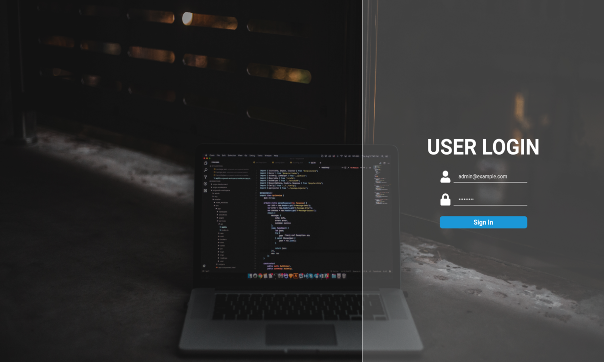
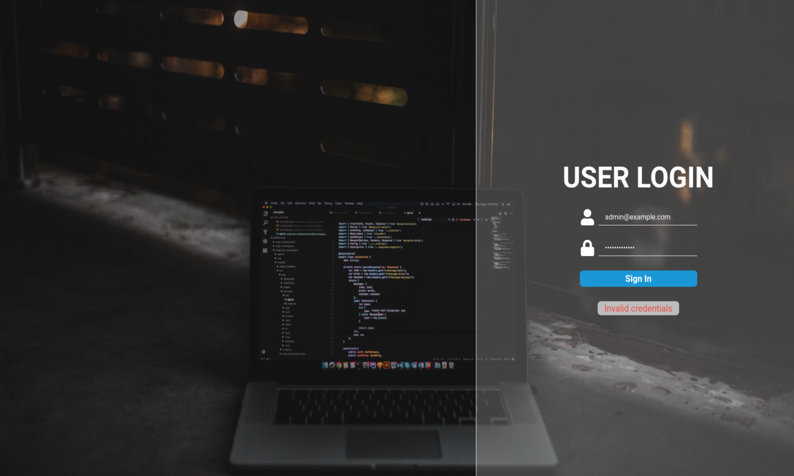
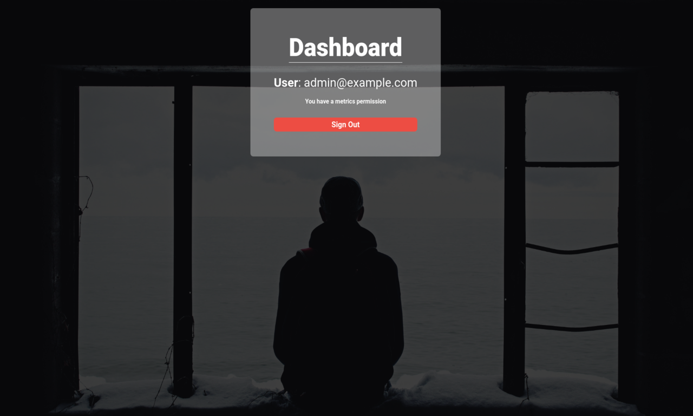

<div align="center">
  <h1>Login system</h1>
  <br>
  <br>
  <p align="center">
    
    
    
  </p>
</div>

# :memo: About this project
A full JWT login system built with Next.js and some productive libraries, the app consumes a simple API built with Node.js.

# :cyclone: How to run this project
```bash
# Clone front-end and back-end repository
$ git clone https://github.com/jefferson1104/authSystemJWT.git

# Navigate to the API directory (back-end), install dependencies and start app with the commands:
$ yarn
$ yarn dev

# Navigate to the front-end directory, install dependencies and start app with the commands:
$ yarn
$ yarn dev

# Access web application in the your browser
http://localhost:3000
```

# 🎨 Screenshots
<p align="center">
  
  
  
  
</p>